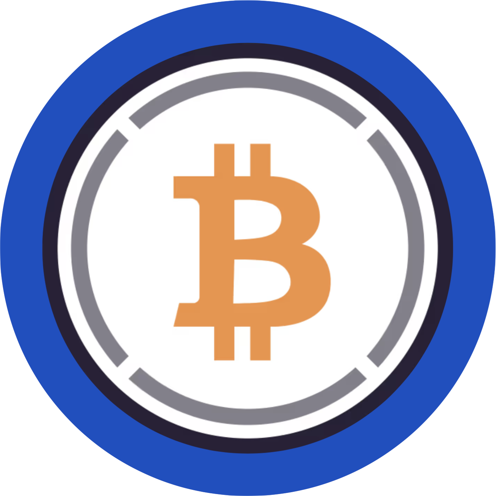
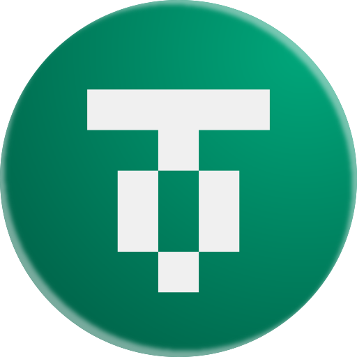

# 🌐 Assets & Networks

Assets bridged to Hedera via [Bonzo Bridge](https://app.bonzo.finance/bridge) arrive on the Hedera network as EVM ERC-20 assets — if you're holding an EVM ERC-20 asset in your account, it must be manually configured to display in HashPack, in order for you to "see" it in your wallet. If using MetaMask, these tokens should automatically appear.

**Token addresses for all assets and networks supported by Bonzo Bridge are available in the table below.**\
\
**HashPack Instructions:**

1. Open HashPack wallet and select an account to view.
2. Directly above (and slightly left) of all your assets on display is a <mark style="color:$success;">**+ Add Token**</mark> button — please click or tap this.
3. You should now see a <mark style="color:$success;">**Or Enter a Token ID**</mark> input field in your wallet.
4. Please input the "EVM Address" of any asset (from the table below) that you'd like visible in your wallet, into the <mark style="color:$success;">**Or Enter a Token ID**</mark> field.
5. Click or tap the <mark style="color:$success;">**Associate Token**</mark> button.


Note: Unlike token associations for HTS assets, "associating" an EVM ERC-20 asset in HashPack does not charge a network / transaction fee to your account.


### Supported Assets

At launch, the following ERC-20 assets can be bridged:

<table><thead><tr><th width="79.765625">Icon</th><th width="97.8515625">Symbol</th><th width="273.88671875" align="center">EVM Address</th><th width="241.2734375" align="center">Description</th></tr></thead><tbody><tr><td>

</td><td><strong>wETH</strong></td><td align="center"><strong>Hedera <code>0xca367694cdac8f152e33683bb36cc9d6a73f1ef2</code></strong>  <em><strong>Note: When bridging wETH to Arbitrum, Base, Optimism, and Ethereum, Bonzo Bridge automatically unwraps to native ETH.</strong></em> </td><td align="center">Wrapped Ethereum is a tokenized version of Ether (ETH), the native currency of the Ethereum blockchain. Auto-unwraps to native ETH when bridging to ETH-native destinations.</td></tr><tr><td>

</td><td><strong>wBTC</strong></td><td align="center">
<strong>Hedera</strong> <strong><code>0xd7d4d91d64a6061fa00a94e2b3a2d2a5fb677849</code></strong>  <strong>Base</strong>

<strong><code>0x0555E30da8f98308EdB960aa94C0Db47230d2B9c</code></strong>  <strong>Optimism</strong> <strong><code>0x68f180fcCe6836688e9084f035309E29Bf0A2095</code></strong>  <strong>Ethereum</strong> <strong><code>0x2260FAC5E5542a773Aa44fBCfeDf7C193bc2C599</code></strong>
</td><td align="center">Wrapped Bitcoin is a tokenized version of Bitcoin (BTC). This asset is an official LayerZero OFT asset issued by BitGo.</td></tr><tr><td></td><td><strong>USDT0</strong></td><td align="center">Coming Soon</td><td align="center">Coming Soon</td></tr></tbody></table>

Additional assets will be added over time based on community demand and asset availability.

### Supported Networks

Bonzo Bridge currently supports transfers between the following EVM networks:

* Hedera
* Ethereum
* Arbitrum
* Base
* Optimism

Additional networks will be added over time based on demand and as supported Stargate / LayerZero endpoints expand.
