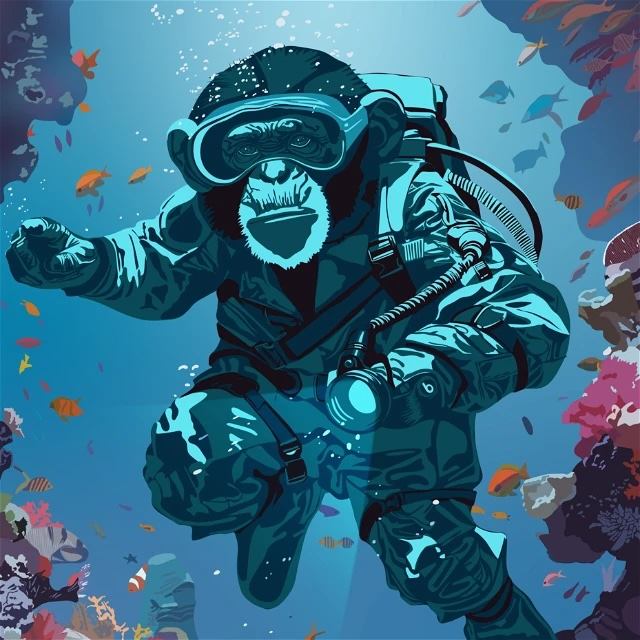

# 🖼️ Bonzo NFT Collectibles

## 1st Edition Bonzo NFT Collectibles

Bonzo NFT Collectibles can now be purchased on secondary NFT marketplaces across the Hedera ecosystem, such as [SentX](https://sentx.io/nft-marketplace/creators/bonzo-finance) and [Kabila](https://market.kabila.app/en/collections).\
\
For more information about Bonzo NFT Collectibles, please see the [1st Edition Bonzo NFTs](1st-edition-bonzo-nfts.md) section of the documentation.

<figure><figcaption>
Desert Bonzo <a href="https://hashscan.io/mainnet/token/0.0.6178137">0.0.6178137</a>
</figcaption></figure> <figure><figcaption>
Ocean Bonzo <a href="https://hashscan.io/mainnet/token/0.0.6178141">0.0.6178141</a>
</figcaption></figure> <figure><figcaption>
Space Bonzo <a href="https://hashscan.io/mainnet/token/0.0.6178143">0.0.6178143</a>
</figcaption></figure> <figure><figcaption>
Singularity Bonzo <a href="https://hashscan.io/mainnet/token/0.0.6173820?p=1&#x26;k=1">0.0.6173820</a>
</figcaption></figure>

## Cybernetic NFT Collectible

The Bonzo Cybernetic NFT collectible will become available for trading on secondary NFT marketplaces across the Hedera ecosystem, such as [SentX](https://sentx.io/nft-marketplace/creators/bonzo-finance) and [Kabila](https://market.kabila.app/en/collections), after its initial sale has concluded.\
\
For more information about Bonzo NFT Collectibles, please see the [Cybernetic NFT](cybernetic-nft.md) section of the documentation.

<figure><figcaption>
Cybernetic Bonzo <a href="https://hashscan.io/mainnet/token/0.0.7743905">0.0.7743905</a>
</figcaption></figure>
