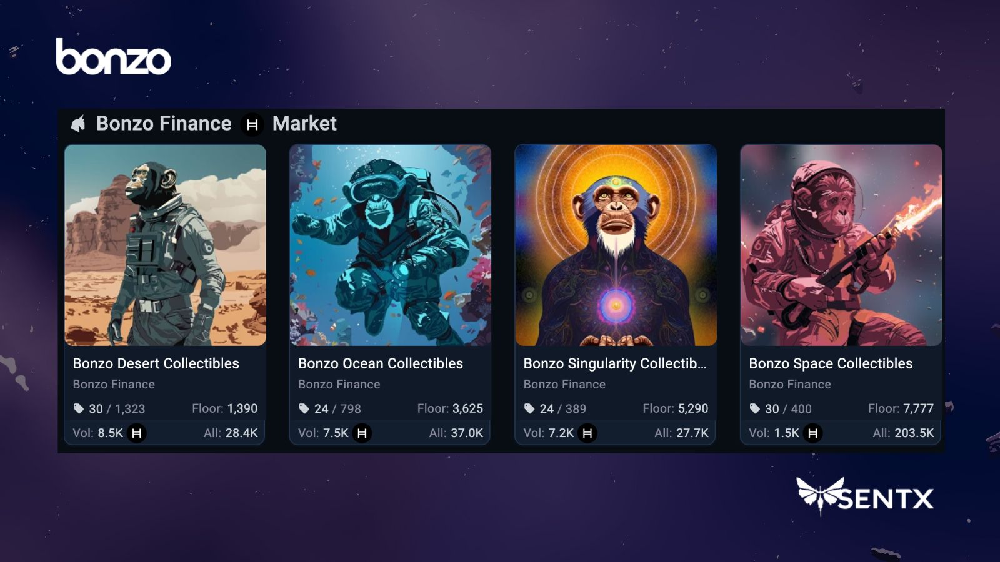

---
layout:
  title:
    visible: true
  description:
    visible: false
  tableOfContents:
    visible: true
  outline:
    visible: true
  pagination:
    visible: true
---

# Season One Points

After the [pre-season](https://docs.bonzo.finance/hub/get-started/bonzo-points/pre-season-points) has concluded and the Bonzo Finance protocol launches on mainnet, season one of Bonzo Points will start. Point earnings convert to claimable $BONZO at the end of a every points season, each lasting 6 months, with three seasons in total.

Points earnings are based on the dollar value of assets supplied to and borrowed from the protocol, distributed on a 24 hour basis — supported assets of the protocol can be found on the [Bonzo Finance homepage](https://bonzo.finance/).

Details of points earning calculations for season one are found in the table below:

<table data-header-hidden><thead><tr><th width="161"></th><th width="299"></th><th></th></tr></thead><tbody><tr><td></td><td><strong>Mainnet Launch</strong> <em>(Supply only until TGE)</em></td><td><strong>After Token Generation Event (TGE)</strong> <em>(Borrowing enabled)</em></td></tr><tr><td><strong>Supply Points</strong></td><td>4 points / $1 USD of token value</td><td>2 points / $1 USD of token value</td></tr><tr><td><strong>Borrow Points</strong></td><td>(<em>Borrowing disabled)</em></td><td>8 points / $1 USD of token value</td></tr></tbody></table>

### **Bonzo NFT Points Multipliers**

Make sure your NFTs are held during snapshot periods to lock in these rewards and accelerate your path to more points and $BONZO earnings. To purchase an NFT on secondary markets, please visit [SentX](https://sentx.io/nft-marketplace/creators/bonzo-finance).

* 🏜️ **Desert Bonzo**: 1.1x multiplier
* 🌊 **Ocean Bonzo**: 1.2x multiplier
* 🚀 **Space Bonzo**: 1.3x multiplier
* 🌌 **Singularity Bonzo**: 1.5x multiplier

Every Bonzo NFT comes with a multiplier that automatically multiplies the points earned during season one, giving you an extra edge in the race to the top of the leaderboard. The multiplier applied to point earnings is based on the single highest tier NFT held in the same account receiving points.

<figure><figcaption></figcaption></figure>
