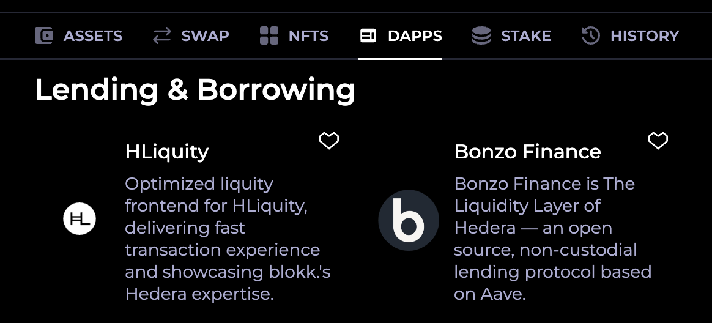

# Connect Wallet

Bonzo Finance supports connectivity with Hedera ecosystem wallets via WalletConnect, with support for MetaMask coming soon.

### HashPack Wallet 

[HashPack](https://www.hashpack.app/) is an ecosystem wallet that offers deeply integrated functionality specific to the Hedera network and its associated ecosystems.&#x20;

For detailed, step-by-step instructions on setting up your HashPack wallet, visit [How to Create Your First Account with HashPack](https://www.hashpack.app/post/how-to-create-your-first-account-with-hashpack).

* For desktop users, install the HashPack extension from the [Chrome Web Store](https://chrome.google.com/webstore/detail/hashpack/gjagmgiddbbciopjhllkdnddhcglnemk).
* For iOS users, download HashPack from the[ Apple App Store](https://apps.apple.com/us/app/hashpack/id6444389849).
* For Android users, you can find HashPack on the[ Google Play Store](https://play.google.com/store/apps/details?id=app.hashpack.wallet.twa).

### Kabila Wallet 

[Kabila](https://www.kabila.app/wallet) is an ecosystem wallet that offers deeply integrated functionality specific to the Hedera network and its associated ecosystems.

* For desktop users, install the HashPack extension from the [Chrome Web Store](https://chromewebstore.google.com/detail/kabila-wallet/cnoepnljjcacmnjnopbhjelpmfokpijm).
* For iOS users, download HashPack from the [Apple App Store](https://apps.apple.com/es/app/kabila-wallet/id6467106529).
* For Android users, you can find HashPack on the [Google Play Store](https://play.google.com/store/apps/details?id=wallet.kabila.app).

## Connecting Wallets to Bonzo Finance 

### **Desktop Browser + Chrome Extension Wallet (WalletConenct)**

1. From the [Bonzo Finance dashboard](../../bonzo-lend/bonzo-lend-quickstart/), click on "Connect Wallet" and choose HashPack or Kabila.
2. The wallet's Chrome extension will open and request selection of a specific account.
3. Select the account you'd like to connect to Bonzo Finance and click "Approve"

### **Desktop Browser + Mobile Device Wallet (WalletConnect)**

1. From the [Bonzo Finance dashboard](../../bonzo-lend/bonzo-lend-quickstart/) on your desktop device, click on "WalletConnect".
2. A "WalletConnect" modal will appear on screen.
3. Open the wallet on your mobile device and navigate to the wallet's "pairing" interface (usually a QR scanner or string input field).
4. Perform either of these actions:
   1. Scan the QR code displayed on Bonzo Finance using the wallet's QR scan pairing functionality on your mobile, or
   2. Copy the pairing string (top right of WalletConnect modal on your desktop) and paste it somewhere visible to manually type it into your mobile device's wallet as a "pairing string"
5. A list of accounts should appear — select the account you'd like to use with Bonzo Finance and tap "Approve" to connect your account.
6. The Bonzo Finance application in your Desktop browser will connect to that account.

### **HashPack's In-Wallet Dapp Browser**

1. If visiting Bonzo Finance from a mobile device, open the HashPack application.
2. After selecting an account, tap on "DAPPS" in the HashPack wallet navigation.
3. Scroll down to "Lending & Borrowing" and tap on "Bonzo Finance".

<figure><figcaption></figcaption></figure>

