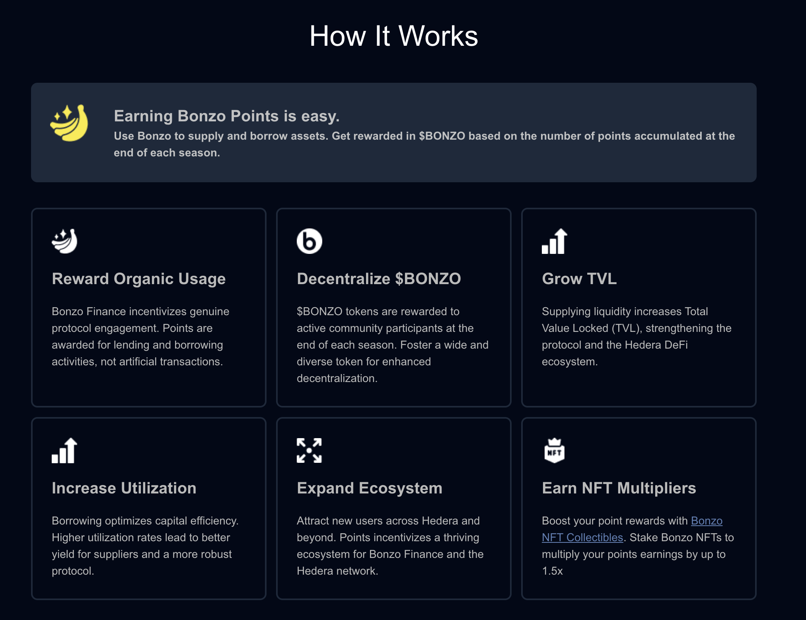

# 🎟️ Bonzo Points

Points incentive programs for protocols and networks are ubiquitous across web3 — from LayerZero, to Kamino and Marginfi on Solana, points programs have been employed across the industry to incentivize protocol growth, liquidity, and adoption, rewarding users for these activities.

The Bonzo Points program rewards active community members who supply liquidity to and borrow liquidity from the Bonzo Finance protocol. Earnings are based on the dollar value of supported HTS assets supplied and borrowed, and distributed on a 24 hour basis. Point earnings convert to claimable $BONZO at the end of a every points season, each lasting 6 months, with three seasons in total.

In addition to the regular seasons of points, Bonzo Finance is hosting a [token weighted pre-season airdrop of points](pre-season-points.md) for holder of HTS assets supported by Bonzo Finance.

<figure><figcaption></figcaption></figure>

### The HCS-20 Points Standard

The Bonzo Points program utilizes the Hedera Consensus Service HCS-20 standard — this offers the unique ability for points to be tied directly to Hedera accounts on-chain — it also allows for airdropping of points to users without them even having to connect their wallets to the protocol. Additionally, because all points are on-chain, they are verifiable and auditable.

To verify earned Bonzo Points on-chain, please visit [TierBot](https://tier.bot/advanced-analytics/hedera/hcs20?tab=my-tokens) and connect your wallet. Additionally, points are visible within the [HashPack wallet](https://www.hashpackapp.com) by navigating to **Advanced Tools > HCS-20 Points.**

