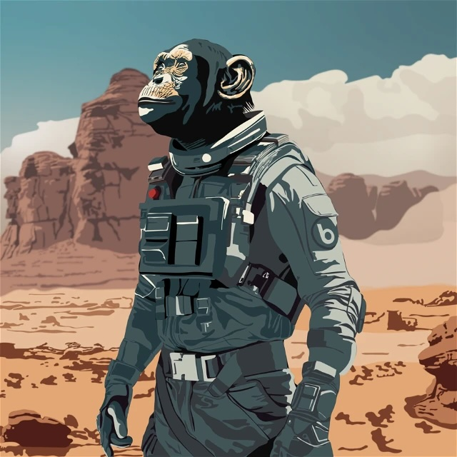
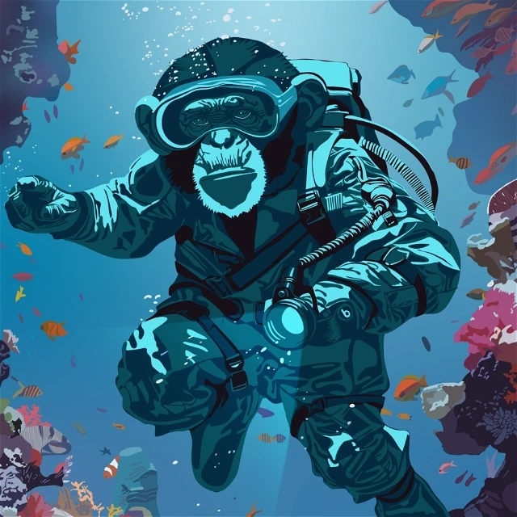
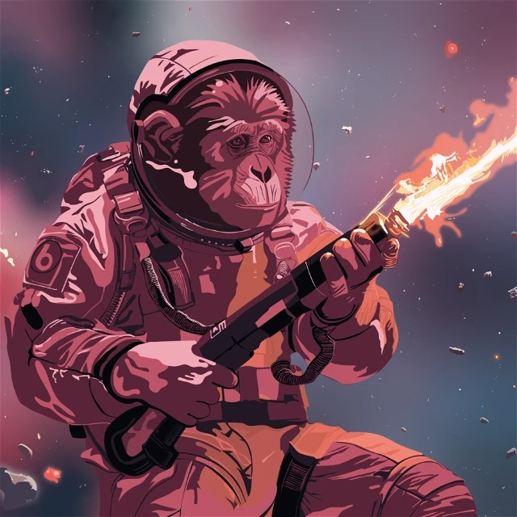
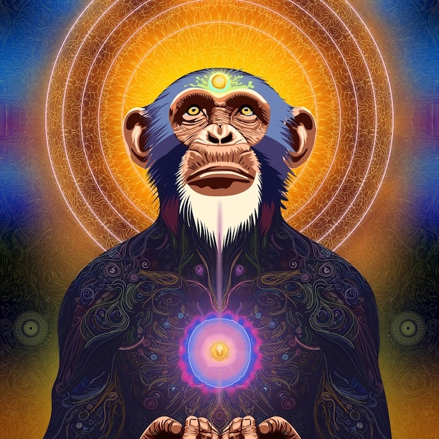

---
layout:
  title:
    visible: true
  description:
    visible: false
  tableOfContents:
    visible: true
  outline:
    visible: true
  pagination:
    visible: true
---

# 🖼️ NFT Collectibles Sale

## Bonzo NFT Collectibles

Bonzo NFT Collectibles can now be purchased on secondary NFT marketplaces across the Hedera ecosystem, such as [SentX](https://sentx.io/nft-marketplace/creators/bonzo-finance) and [Kabila](https://market.kabila.app/en/collections).

<figure><figcaption>
Desert Bonzo 0.0.6178137
</figcaption></figure>

 

<figure><figcaption>
Ocean Bonzo 0.0.6178141
</figcaption></figure>

 

<figure><figcaption>
Space Bonzo 0.0.6178143
</figcaption></figure>

 

<figure><figcaption>
Singularity Bonzo Airdrop | July 2nd 2024
</figcaption></figure>

### **🪙  Distribution of $BONZO tokens**

* Accounts holding Bonzo NFT Collectibles are eligible to receive airdrop distributions of $BONZO. The distribution schedule of $BONZO tokens to NFT holders is found in the table below.
* Prior to each distribution, a snapshot will be taken to determine which accounts are holding a Bonzo NFT Collectible.
* The dates and times of these snapshots will be communicated through the official Bonzo Finance [𝕏](https://www.x.com/bonzo\_finance) and [Discord](https://bonzo.finance/discord).&#x20;
* In order to best serve the health of the Bonzo Finance protocol and needs of the Bonzo Finance community, the distribution dates and fractional amounts per distribution are subject to change. Regardless of these changes, holders of Bonzo Finance NFTs upon snapshot(s) will receive the guaranteed amount of $BONZO tokens per NFT no later than 12 months post-TGE (token generation event).

<table><thead><tr><th width="204"></th><th width="252">Distribution Date(s)</th><th>Amount</th></tr></thead><tbody><tr><td><strong>Distribution #1</strong></td><td>Upon TGE  (token generation event)  [no later than 3 months after mainnet launch of the Bonzo Finance protocol]</td><td>1/2 of "claimable" $BONZO per NFT</td></tr><tr><td><strong>Distribution #2</strong></td><td>End of "Season 1" points [est. February 2025]</td><td>1/4 of "claimable" $BONZO per NFT</td></tr><tr><td><strong>Distribution #3</strong></td><td>End of "Season 2" points [est. August 2025]</td><td>1/4 of "claimable" $BONZO per NFT</td></tr></tbody></table>

### **⭐️  Bonus $BONZO Tokens**

If a single account purchases and holds 20+ of the Desert Bonzo, 20+ of the Ocean Bonzo, or 20+ of the Space Bonzo NFT, they will receive a bonus of:

* 4,125 $BONZO (for holding 20+ of Desert)
* 12,375 $BONZO (for holding 20+ of Ocean)&#x20;
* 24,875 $BONZO (for holding 20+ of Space)
* \*Cannot combine Desert, Ocean, and Space NFTs to reach the 20+ amount.

This bonus distribution will be made in full to the NFT holding account upon TGE (token generation event)

**In order to receive this bonus distribution:**&#x20;

* The purchasing account must be holding the NFT(s) during the first snapshot taken at the end of the NTF sale
* They must still be holding the NFTs in their account during a second snapshot that will randomly take place prior to the TGE.
* The second snapshot date and time will not be disclosed.

### **🌐 Public NFT Collectibles Sale**

After the allowlist sale concludes, remaining NFTs will be made available for purchase through a public sale utilizing [HeadStarter](https://app.headstarter.org/projects/bonzo-finance-pre-liquidity-ino), as well. The public sale will last for approximately 7 days or until sold out.

### **🖼️ Bonzo NFT Collectables Utility**

The three NFT tiers available for purchase are as follows:

<table><thead><tr><th width="140"></th><th align="center">Desert</th><th width="217" align="center">Ocean</th><th align="center">Space</th></tr></thead><tbody><tr><td>Token ID</td><td align="center"><a href="https://hashscan.io/mainnet/token/0.0.6178137">0.0.6178137</a></td><td align="center"><a href="https://hashscan.io/mainnet/token/0.0.6178141">0.0.6178141</a></td><td align="center"><a href="https://hashscan.io/mainnet/token/0.0.6178143">0.0.6178143</a></td></tr><tr><td><strong>Circulating Supply</strong></td><td align="center">1,323</td><td align="center">798</td><td align="center">400</td></tr><tr><td><strong>Current Utility</strong></td><td align="center">
• Dedicated “Desert” role in Discord

• Early access to Bonzo PFP avatars

• $BONZO faucet rewards in Discord

• 1.1x “banana” points multiplier for utilization of protocol

• Ability to claim up to 3,300 $BONZO tokens
</td><td align="center">
• Dedicated “Ocean” role in Discord 

• Early access to Bonzo PFP avatars 

• $BONZO faucet rewards in Discord 

• 1.2x “banana” points multiplier for utilization of protocol  • Ability to claim up to 9,900 $BONZO tokens 
</td><td align="center">
• Dedicated “Space” role in Discord 

• Early access to Bonzo PFP avatars 

• $BONZO faucet rewards in Discord 

• 1.3x “banana” points multiplier for utilization of protocol  • Ability to claim up to 19,900 $BONZO tokens
</td></tr></tbody></table>

A fourth “Singularity” NFT collectible will be sent to all accounts holding each of the three NFTs listed above after the sale has commenced and an account “snapshot” taken. Utility for the "Singularity" NFT is as follows:&#x20;

<table><thead><tr><th width="140"></th><th align="center">Singularity</th></tr></thead><tbody><tr><td>Token ID</td><td align="center">Coming Soon</td></tr><tr><td><strong>Circulating Supply</strong></td><td align="center">Airdrop | July 2nd 2024</td></tr><tr><td><strong>Current Utility</strong></td><td align="center">• Dedicated “Singularity” role in Discord  • Early access to Bonzo PFP avatars  • $BONZO faucet rewards in Discord  • 1.5x “banana” points multiplier for utilization of protocol • Ability to claim up to 1,175 $BONZO tokens</td></tr></tbody></table>

### **👑  Royalty Fee**

There are royalty fees configured for Bonzo NFTs as outlined in the table below.

<table><thead><tr><th width="244">Description</th><th>% Fee</th></tr></thead><tbody><tr><td>Bonzo Finance</td><td>4.5%</td></tr><tr><td>InAMaze Artist</td><td>0.5%</td></tr></tbody></table>
