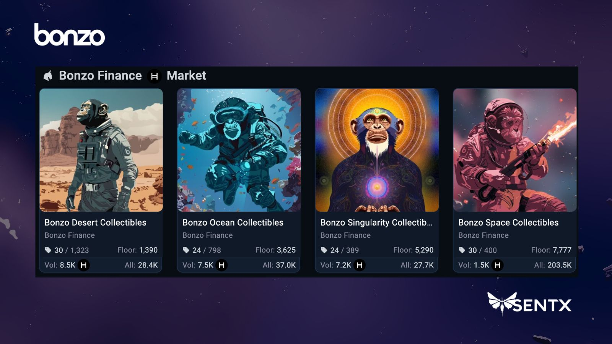

# Pre-Season Points Airdrop

The [token-weighted airdrop of points](https://app.bonzo.finance/points) in the pre-season kicked off on **Friday, September 13th, 2024, at 4:00 PM ET**, starting with a snapshot of holders and amounts of assets in the program. The first distribution of Bonzo Points was made on **Monday, September 16th, 2024,** for the $HBARX asset and continued every other business day with a new points airdrop for every HTS asset supported by the program.

### **Key Points**

* Non-linear token-weighted distribution of points
* Unique regression curve for each asset (made available in the documentation)
* Leaderboard and earnings were updated every 24 hours in the [Bonzo Finance](https://app.bonzo.finance/points) app
* Accumulated points determined $BONZO token claims at the Token Generation Event (TGE)

<figure><figcaption></figcaption></figure>

### **Snapshot**

* **Date**: September 13th, 2024 at 4:00 PM ET

### **Airdrop Distribution for Token-Weighted Pre-Season Points**

Points will be distributed across multiple days, based on a schedule tied to assets supported by the protocol:

* Mon, Sept 16: $HBARX ([Distribution Details](https://docs.google.com/spreadsheets/d/1rVUDzVOQFta8qfO-JxmhI959Hbo3AXam6etWpzXHblE/edit?usp=sharing))
* Wed, Sept 18: $PACK ([Distribution Details](https://docs.google.com/spreadsheets/d/1hZAsOF57eGFInPXJb-Toga4nXVnArQ9_pv0dZ6OmQGw/edit?usp=sharing))
* Fri, Sept 20: $SAUCE ([Distribution Details](https://docs.google.com/spreadsheets/d/1TzQCSNzCGfKaMecD_UyEvu7nU3j1L-9SlkDx3i1ERxo/edit?gid=1745000703#gid=1745000703))
* Fri, Sept 20: $XSAUCE ([Distribution Details](https://docs.google.com/spreadsheets/d/1cegHkUzdi04U6z4uaH-quiJl4brA8ZUbJtaLxdDO3yY/edit?gid=984072007#gid=984072007))
* Mon, Sept 23: $DOVU ([Distribution Details](https://docs.google.com/spreadsheets/d/1-C3bukxV0YeHBTKAv-8CbNyftpvTzOBc2NCCzNdC7EI/edit?gid=375635124#gid=375635124))
* Wed, Sept 25: $KARATE ([Distribution Details](https://docs.google.com/spreadsheets/d/1pKX1P2OKlwOenPL_QvaDfT3CwJDoGVQPKgmfLfI3RB0/edit?usp=sharing))
* Fri, Sept 27: $HST ([Distribution Details](https://docs.google.com/spreadsheets/d/1Lgu5brxhDVqzm__JAYIB-cANFJ_9V6fnhatKt9gp3og/edit?usp=sharing))
* Mon, Sept 30: $STEAM ([Distribution Details](https://docs.google.com/spreadsheets/d/15ls027YE8NdSu4nhePiw8IzsLKtXLSpET2esZkmtjrA/edit?gid=31857120#gid=31857120))
* Wed, Oct 2: $USDC ([Distribution Details](https://docs.google.com/spreadsheets/d/1LgyOeudlU3LqMG4sp_jmAq-GTWLfOUTaKUwNVnTU4gI/edit?usp=sharing))

### **Bonzo NFT Points Multipliers**

Every Bonzo NFT came with a multiplier that automatically multiplies the points you earn during pre-season airdrops, giving holders an extra edge in the race to the top of the leaderboard. The multiplier applied to point earnings was based on the single highest tier NFT held in the same account that received points.

* 🏜️ **Desert Bonzo**: 1.1x multiplier
* 🌊 **Ocean Bonzo**: 1.2x multiplier
* 🚀 **Space Bonzo**: 1.3x multiplier
* 🌌 **Singularity Bonzo**: 1.5x multiplier

NFTs needed to be held during snapshot periods to lock in these rewards and accelerate the path to more points and $BONZO earnings.

<figure><figcaption></figcaption></figure>

### How Pre-Season Points Worked

#### Step 1: Points Snapshot

* Date: September 13th, 2024, 4:00 PM ET
* Applied to all supported assets

#### Step 2: Points Airdrop

* First airdrop: September 16th, 2024 ($HBARX)
* Frequency: Every other business day (schedule above)
* Covered all HTS assets supported by the program
* Points were updated on [Bonzo Finance points leaderboard](https://app.bonzo.finance/points) after each airdrop

#### Step 3: Check the Leaderboard

* Location: [app.bonzo.finance/points](http://app.bonzo.finance/points)
* Users connected their HashPack wallet to view earned points & account ranking against others in the ecosystem
